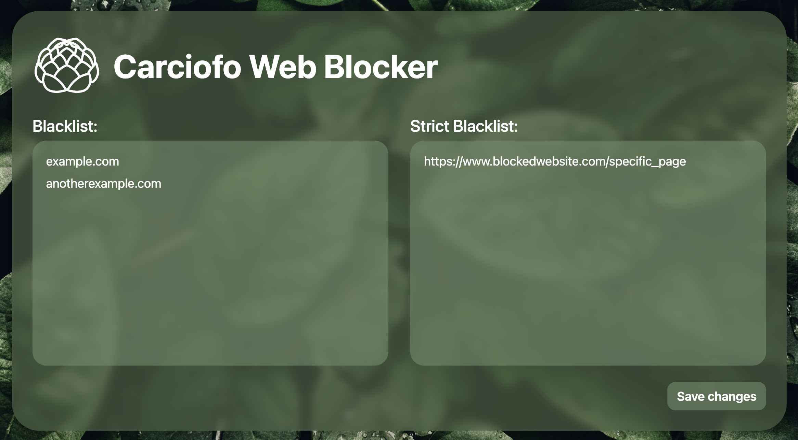

# Carciofo Web Blocker
A simple web blocker that works right out of the box.

## About
Carciofo Web Blocker is a Chrome extension that denies user access to certain websites defined by blocklists. No sign-ups, no overwhelming configurations; just a simple and modern-looking extension that does what it is meant to do - block websites!

## Instructions
In the Chrome extension's options page, there are two distinct blocklists: Blacklist and Strict Blacklist.

### Blacklist
For most use cases, the Blacklist can be used to block entire websites or domains.
* Any websites with links that match to an entry in the Blacklist will be blocked.
* Entries in the Blacklist are separated by new lines.

### Strict Blacklist
For "page-by-page" use cases, the Strict Blacklist can used to block specific web addresses.
* Only websites with links that are exact matches will be blocked by the Strict Blacklist.
* Entries in the Strict Blacklist are separated by new lines.
* Entries in the Strict Blacklist **must** contain their protocol (e.g. `https://`) in order to work.

For example, in the picture shown below, any websites containing `example.com` or `anotherexample.com` in their URL will be blocked. This includes links of the form `mail.example.com` or `example.com/specific_page`.
`www.blockedwebsite.com/specific_page` will also be blocked by the extension, but only this specific webpage, not `www.blockedwebsite.com` or `www.blockedwebsite.com/specific_page/another_page`.

## Acknowledgments
Inspired by the extension [Strict Workflow](https://chromewebstore.google.com/detail/cgmnfnmlficgeijcalkgnnkigkefkbhd) by Matchu.
[Background photo](https://www.pexels.com/photo/close-up-photography-of-leaves-with-droplets-807598/) taken by sohail nachiti.